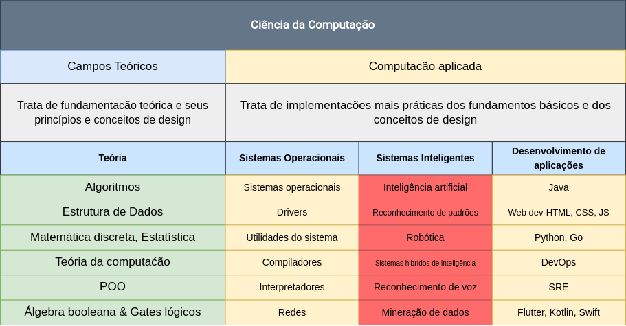
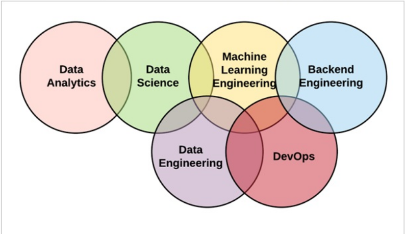

# Campos de estudo da Ciência da Computação.

A ciência da computação é uma ciência interdisciplinar ou seja seus campos de estudos envolvem a combinação de várias disciplinas.

<h1 align="center">
  
</h1>

Acima vemos os campos teóricos e os que aplicam esses conceitos no mundo real.

<h1 align="center">
  
</h1>

Podemos ver acima que todos os campos de estudo se correlacionam de alguma forma, ou seja, para entender Data Science você precisa de entender de Analise de dados, Apredizagem de maquina e Engenharia de dados.